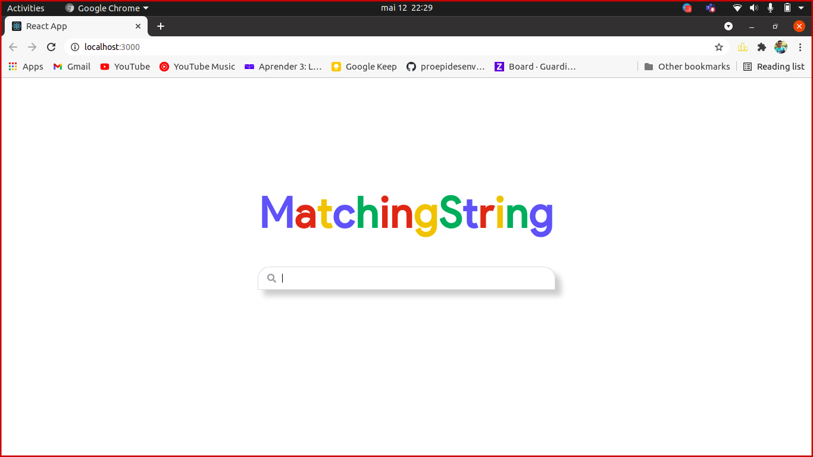
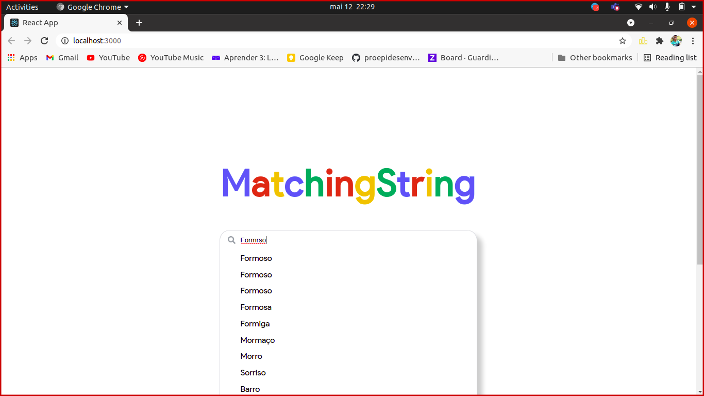

# Matching String

**Conteúdo da Disciplina**: Projeto Final

## Alunos
|Matrícula | Aluno |
| -- | -- |
| 18/0033743  |  João Pedro Silva de Carvalho |
| 18/0028324  |  Thiago Luiz de Souza Gomes |

## Sobre 
Um sistema de sugestão de palavras baseado em um calculo de distância entre as strings, ou seja um sistema de busca parecido com o do Google.

## Screenshots

 

 

 

## Instalação 
**Linguagem**: JavaScript

Necessita do Node.js versão 12 ou maior.

## Uso 

Na raiz do repositório apenas digite:

~~~Shell
npm install

npm start
~~~

